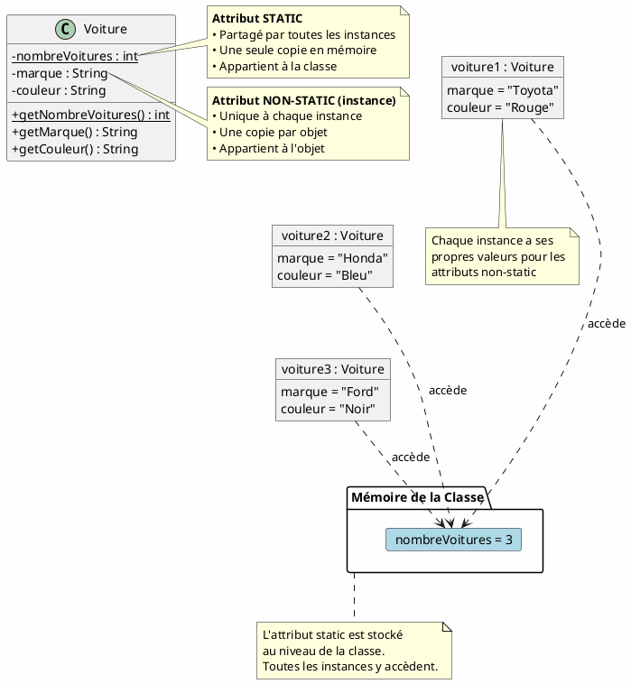

# 2. Mot-clé `static`

Le mot-clé `static` est un modificateur qui permet de définir des éléments (attributs ou méthodes) qui appartiennent à
la classe elle-même plutôt qu'aux instances de cette classe[1].

## Attributs Statiques

Un attribut statique possède les caractéristiques suivantes :

- Une seule copie de la variable est créée et partagée entre tous les objets de la classe[1]
- Il existe dès que la classe est chargée en mémoire, avant même la création d'instances[2]
- Il est accessible directement par le nom de la classe, sans créer d'instance[1]

Par exemple :

```java
public class Compteur {
    public static int nombreTotal = 0;

    public Compteur() {
        nombreTotal++; // Incrémente le compteur partagé
    }
}
```

## Méthodes Statiques

Une méthode statique a plusieurs caractéristiques importantes :

- Elle appartient à la classe et non aux instances[3]
- Elle ne peut accéder qu'aux autres membres statiques de la classe[3]
- Elle ne peut pas utiliser les mots-clés `this` ou `super`[1]
- Elle est appelée directement sur la classe, sans créer d'instance[3]

## Pourquoi main() est Static

La méthode `main` doit être statique car elle doit pouvoir être exécutée par la JVM avant la création de toute instance
de classe[3]. Comme elle est le point d'entrée du programme, elle doit être accessible sans avoir besoin d'instancier la
classe qui la contient[2].

## Exemple d'Utilisation

```java
public class Exemple {
    public static int compteur = 0;  // Variable statique

    public static void incrementer() {  // Méthode statique
        compteur++;
    }
}
```

```java
// Utilisation
Exemple.incrementer();  // Appel sans instance
System.out.println(Exemple.compteur);  // Accès direct
```

??? note "Citations"
    - [1] https://waytolearnx.com/2018/11/le-mot-cle-static-en-java.html
    - [2] https://perso.telecom-paristech.fr/hudry/coursJava/avance/static.html
    - [3] https://www.guru99.com/fr/static-variable-in-java.html
    - [4] https://javarush.com/fr/groups/posts/fr.3874.pause-caf-142-quel-rle-le-mot-cl-static-joue-t-il-en-java-
    - [5] https://blog.paumard.org/cours/java/chap04-structure-classe-statique.html

# Exemple : classes `Voiture`

## 📊 Diagramme UML

Voici une représentation visuelle de la différence entre ces deux types d'attributs :



??? note "Code source du diagramme"
    ```plantuml
    @startuml
    allowmixing
    skinparam classAttributeIconSize 0
    skinparam backgroundColor #FEFEFE
    
    class Voiture {
      {static} -nombreVoitures : int
      -marque : String
      -couleur : String
      {static} +getNombreVoitures() : int
      +getMarque() : String
      +getCouleur() : String
    }
    
    note right of Voiture::nombreVoitures
      **Attribut STATIC**
      • Partagé par toutes les instances
      • Une seule copie en mémoire
      • Appartient à la classe
    end note
    
    note right of Voiture::marque
      **Attribut NON-STATIC (instance)**
      • Unique à chaque instance
      • Une copie par objet
      • Appartient à l'objet
    end note
    
    object "voiture1 : Voiture" as v1 {
      marque = "Toyota"
      couleur = "Rouge"
    }
    
    object "voiture2 : Voiture" as v2 {
      marque = "Honda"
      couleur = "Bleu"
    }
    
    object "voiture3 : Voiture" as v3 {
      marque = "Ford"
      couleur = "Noir"
    }
    
    package "Mémoire de la Classe" as classMemory {
      card "nombreVoitures = 3" as staticAttr #LightBlue
    }
    
    v1 -[hidden]- v2
    v2 -[hidden]- v3
    
    note bottom of classMemory
      L'attribut static est stocké
      au niveau de la classe.
      Toutes les instances y accèdent.
    end note
    
    note bottom of v1
      Chaque instance a ses
      propres valeurs pour les
      attributs non-static
    end note
    
    v1 ..> staticAttr : accède
    v2 ..> staticAttr : accède
    v3 ..> staticAttr : accède
    
    @enduml
    ```


**Observation importante** : Sur le diagramme, vous pouvez voir que :

- Les trois objets (`voiture1`, `voiture2`, `voiture3`) ont chacun leurs propres valeurs pour `marque` et `couleur`
- Mais ils partagent tous le même `nombreVoitures` stocké au niveau de la classe

---

## 💻 Implémentation en Java

Voici le code Java complet qui correspond au diagramme ci-dessus :

??? note "Code"
    ```java
    public class Voiture {
        // Attribut STATIC - partagé par toutes les instances
        private static int nombreVoitures = 0;
    
        // Attributs NON-STATIC (d'instance) - propres à chaque objet
        private String marque;
        private String couleur;
    
        // Constructeur
        public Voiture(String marque, String couleur) {
            this.marque = marque;
            this.couleur = couleur;
            nombreVoitures++; // Incrémente le compteur à chaque création
        }
    
        // Méthode STATIC - peut être appelée sans instance
        public static int getNombreVoitures() {
            return nombreVoitures;
        }
    
        // Méthodes NON-STATIC (d'instance) - nécessitent une instance
        public String getMarque() {
            return marque;
        }
    
        public String getCouleur() {
            return couleur;
        }
    
        // Méthode pour afficher les informations de la voiture
        public void afficherInfo() {
            System.out.println("Voiture: " + marque + ", Couleur: " + couleur);
        }
    
        // Main pour démonstration
        public static void main(String[] args) {
            System.out.println("=== Démonstration Static vs Non-Static ===\n");
    
            // Appel de la méthode static AVANT de créer des instances
            System.out.println("Nombre de voitures au départ: " + Voiture.getNombreVoitures());
            System.out.println();
    
            // Création des instances
            System.out.println("Création de voiture1...");
            Voiture voiture1 = new Voiture("Toyota", "Rouge");
            voiture1.afficherInfo();
            System.out.println("Nombre total de voitures: " + Voiture.getNombreVoitures());
            System.out.println();
    
            System.out.println("Création de voiture2...");
            Voiture voiture2 = new Voiture("Honda", "Bleu");
            voiture2.afficherInfo();
            System.out.println("Nombre total de voitures: " + Voiture.getNombreVoitures());
            System.out.println();
    
            System.out.println("Création de voiture3...");
            Voiture voiture3 = new Voiture("Ford", "Noir");
            voiture3.afficherInfo();
            System.out.println("Nombre total de voitures: " + Voiture.getNombreVoitures());
            System.out.println();
    
            // Démonstration: chaque instance a ses propres attributs non-static
            System.out.println("=== Attributs NON-STATIC (propres à chaque instance) ===");
            System.out.println("Marque de voiture1: " + voiture1.getMarque());
            System.out.println("Marque de voiture2: " + voiture2.getMarque());
            System.out.println("Marque de voiture3: " + voiture3.getMarque());
            System.out.println();
    
            // Démonstration: l'attribut static est partagé
            System.out.println("=== Attribut STATIC (partagé par toutes les instances) ===");
            System.out.println("Accès via la classe: " + Voiture.getNombreVoitures());
            System.out.println("Accès via voiture1: " + voiture1.getNombreVoitures());
            System.out.println("Accès via voiture2: " + voiture2.getNombreVoitures());
            System.out.println("Accès via voiture3: " + voiture3.getNombreVoitures());
            System.out.println("→ Tous retournent la même valeur car c'est un attribut STATIC!");
        }
    }
    ```

---

## 🔍 Analyse du code

### Déclaration des attributs

```java
private static int nombreVoitures = 0;  // STATIC
private String marque;                   // NON-STATIC
private String couleur;                  // NON-STATIC
```

- `nombreVoitures` est **static** : il y a une seule variable partagée par toutes les voitures
- `marque` et `couleur` sont **non-static** : chaque voiture a sa propre marque et couleur

### Dans le constructeur

```java
public Voiture(String marque, String couleur) {
    this.marque = marque;        // Initialise l'attribut d'instance
    this.couleur = couleur;      // Initialise l'attribut d'instance
    nombreVoitures++;            // Incrémente l'attribut static (partagé)
}
```

Chaque fois qu'on crée une nouvelle `Voiture`, le compteur **static** `nombreVoitures` augmente de 1.

### Accès aux attributs

```java
// Méthode static - peut être appelée sans objet
public static int getNombreVoitures() {
    return nombreVoitures;
}

// Méthode non-static - nécessite un objet
public String getMarque() {
    return marque;
}
```

---

## 🎬 Exécution et résultat

**Sortie attendue :**

```
=== Démonstration Static vs Non-Static ===

Nombre de voitures au départ: 0

Création de voiture1...
Voiture: Toyota, Couleur: Rouge
Nombre total de voitures: 1

Création de voiture2...
Voiture: Honda, Couleur: Bleu
Nombre total de voitures: 2

Création de voiture3...
Voiture: Ford, Couleur: Noir
Nombre total de voitures: 3

=== Attributs NON-STATIC (propres à chaque instance) ===
Marque de voiture1: Toyota
Marque de voiture2: Honda
Marque de voiture3: Ford

=== Attribut STATIC (partagé par toutes les instances) ===
Accès via la classe: 3
Accès via voiture1: 3
Accès via voiture2: 3
Accès via voiture3: 3
→ Tous retournent la même valeur car c'est un attribut STATIC!
```

---

## 📝 Tableau récapitulatif

| Critère               | Attribut NON-STATIC            | Attribut STATIC                          |
|-----------------------|--------------------------------|------------------------------------------|
| **Appartenance**      | À l'objet (instance)           | À la classe                              |
| **Copies en mémoire** | Une par objet créé             | Une seule pour toute la classe           |
| **Accès**             | `objet.attribut`               | `Classe.attribut` (recommandé)           |
| **Initialisation**    | Dans le constructeur           | À la déclaration ou dans un bloc static  |
| **Mot-clé**           | Aucun                          | `static`                                 |
| **Cas d'usage**       | Données propres à chaque objet | Données partagées, constantes, compteurs |

---

## 💡 Cas d'usage courants

### Attributs non-static (d'instance)

- Caractéristiques propres à un objet : nom, âge, couleur, prix, etc.
- Données qui varient d'une instance à l'autre

### Attributs static (de classe)

- **Constantes** : `public static final double PI = 3.14159;`
- **Compteurs** : nombre d'instances créées
- **Configuration partagée** : paramètres communs à tous les objets
- **Utilitaires** : méthodes qui ne dépendent pas d'un état d'objet

---

## ⚠️ Bonnes pratiques

1. **Utilisez `static` avec parcimonie** : seulement quand c'est vraiment nécessaire
2. **Nommage** : les constantes static sont en MAJUSCULES : `MAX_SIZE`
3. **Accès** : privilégiez `Classe.methodeStatic()` plutôt que `objet.methodeStatic()`
4. **Méthodes static** : ne peuvent accéder qu'aux membres static de la classe
5. **Thread-safety** : attention aux attributs static mutables en environnement multi-thread

---

## 🧪 Exercice

Ajoutez à la classe `Voiture` :

- Un attribut static `prixEssence` (même prix pour toutes les voitures)
- Une méthode pour calculer le coût d'un trajet en fonction de la distance

---

## ✅ Points à retenir

1. **Non-static = une copie par objet** → pour les données spécifiques à chaque instance
2. **Static = une copie pour toute la classe** → pour les données partagées
3. Les attributs static existent **même sans créer d'objet**
4. Les méthodes static ne peuvent **pas** accéder aux attributs non-static
5. Les attributs static sont utiles pour les **compteurs**, **constantes** et **configurations partagées**


-------

??? info "Utilisation de l'IA"
    Page rédigée en partie avec l'aide d'un assistant IA. L'IA a été utilisée pour générer des
    explications, des exemples et/ou des suggestions de structure. Toutes les informations ont
    été vérifiées, éditées et complétées par l'auteur.