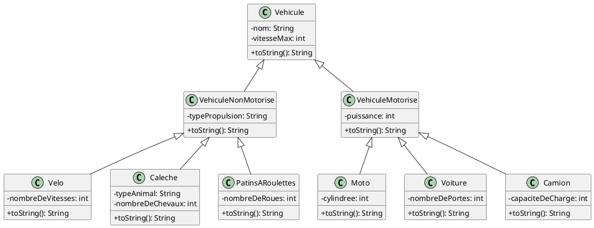
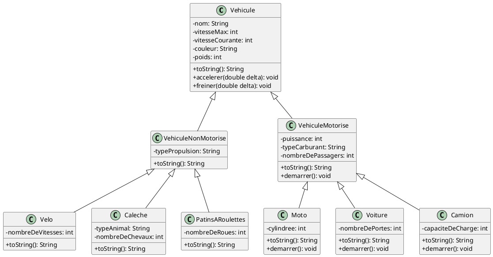

# 5. Exercices sur un système de gestion de véhicules

Voici un exercice sur un système de gestion de véhicules, basé en partie sur l'exemple précédent.

## Partie 1

1. Crée un projet dans IntelliJ nommé `Vehicules`.
2. Crée un *package* nommé `vehicules` dans le dossier `src`.
3. Crée toutes les classes données dans le diagramme de classes suivant.
4. Teste ton code avec le `main` qui suit le diagramme.
    - Pour tester tes classes avec le code du `Main`, tu devras ajouter au moins un constructeur par classe.
5. Ajoutes des *getters* et des *setters* pour tes classes.

### Diagramme de classes



??? important "Source PlantUML"

    ```plantuml
    @startuml
    skinparam classAttributeIconSize 0

    class Vehicule {
        - nom: String
        - vitesseMax: int
        + toString(): String
    }
    
    class VehiculeNonMotorise {
        - typePropulsion: String
        + toString(): String
    }
    
    class VehiculeMotorise {
        - puissance: int
        + toString(): String
    }
    
    class Velo {
        - nombreDeVitesses: int
        + toString(): String
    }
    
    class Caleche {
        - typeAnimal: String
        - nombreDeChevaux: int
        + toString(): String
    }
    
    class PatinsARoulettes {
        - nombreDeRoues: int
        + toString(): String
    }
    
    class Moto {
        - cylindree: int
        + toString(): String
    }
    
    class Voiture {
        - nombreDePortes: int
        + toString(): String
    }
    
    class Camion {
        - capaciteDeCharge: int
        + toString(): String
    }
    
    Vehicule <|-- VehiculeNonMotorise
    Vehicule <|-- VehiculeMotorise
    VehiculeNonMotorise <|-- Velo
    VehiculeNonMotorise <|-- Caleche
    VehiculeNonMotorise <|-- PatinsARoulettes
    VehiculeMotorise <|-- Moto
    VehiculeMotorise <|-- Voiture
    VehiculeMotorise <|-- Camion
    
    @enduml
    ```

### `Main.java`

```java
import vehicules.*;

public class Main {
    public static void main(String[] args) {
        Velo velo = new Velo("VTT", 40, 21);
        Caleche caleche = new Caleche("vehicules.Caleche de luxe", 10, "Cheval", 2);
        PatinsARoulettes patins = new PatinsARoulettes("Patins de vitesse", 30, 4);
        Moto moto = new Moto("Honda CB500F", 180, 47, 500);
        Voiture voiture = new Voiture("Peugeot 308", 220, 130, 5);
        Camion camion = new Camion("Mercedes-Benz Actros", 120, 500, 20);

        System.out.println("Détails du vélo:\n" + velo);
        System.out.println("\nDétails de la calèche:\n" + caleche);
        System.out.println("\nDétails des patins à roulettes:\n" + patins);
        System.out.println("\nDétails de la moto:\n" + moto);
        System.out.println("\nDétails de la voiture:\n" + voiture);
        System.out.println("\nDétails du camion:\n" + camion);
    }
}
```

## Partie 2

Faites les modifications suivantes au projet.

### Attributs à Ajouter

1. **Couleur** : Ajouter un attribut `couleur` à la classe `Vehicule`.
2. **Poids** : Ajouter un attribut `poids` à la classe `Vehicule`.
3. **Type de Carburant** : Ajouter un attribut `typeCarburant` à la classe `VehiculeMotorise`.
4. **Nombre de Passagers** : Ajouter un attribut `nombreDePassagers` à la classe `VehiculeMotorise`.
5. **Vitesse Courante** : Ajouter un attribut `vitesseCourante` à la classe `Vehicule`.

Ajouter également les *getters* et *setters* correspondants.

### Méthodes à Ajouter

1. **Méthode `demarrer()`** : Ajouter une méthode `demarrer()` à la classe `VehiculeMotorise` pour simuler le démarrage
   du moteur.
2. **Méthode `accelerer(double delta)`** : Ajouter une méthode `accelerer()` à la classe `Vehicule` pour
   simuler l'accélération.
3. **Méthode `freiner(double delta)`** : Ajouter une méthode `freiner()` à la classe `Vehicule` pour simuler le
   freinage.

Le but de cet exercice est de comprendre l'héritage et le polymorphisme. Le but n'est pas de faire une simulation exacte
du comportement des véhicules. Vous pouvez par exemple placer des `println` dans les méthodes, et utiliser le paramètre
`double delta` pour ajouter ou enlever à la vitesse courante, et ne pas calculer l'accélération avec les formules
physiques correctes.

### Utilisation du Polymorphisme

- Créer un tableau ou une liste de `Vehicule` et y ajouter des instances de différentes sous-classes.
- Itérer sur ce tableau pour appeler les méthodes ajoutées (`demarrer()`, `accelerer()`, `freiner()`, `calculerPrix()`)
  pour démontrer le polymorphisme.

### Diagramme de classes



??? important "Source PlantUML"

    ```plantuml
    @startuml
    skinparam classAttributeIconSize 0
    
    class Vehicule {
        - nom: String
        - vitesseMax: int
        - vitesseCourante: int
        - couleur: String
        - poids: int
        + toString(): String
        + accelerer(double delta): void
        + freiner(double delta): void
    }
    
    class VehiculeNonMotorise {
        - typePropulsion: String
        + toString(): String
    }
    
    class VehiculeMotorise {
        - puissance: int
        - typeCarburant: String
        - nombreDePassagers: int
        + toString(): String
        + demarrer(): void
    }
    
    class Velo {
        - nombreDeVitesses: int
        + toString(): String
    }
    
    class Caleche {
        - typeAnimal: String
        - nombreDeChevaux: int
        + toString(): String
    }
    
    class PatinsARoulettes {
        - nombreDeRoues: int
        + toString(): String
    }
    
    class Moto {
        - cylindree: int
        + toString(): String
        + demarrer(): void
    }
    
    class Voiture {
        - nombreDePortes: int
        + toString(): String
        + demarrer(): void
    }
    
    class Camion {
        - capaciteDeCharge: int
        + toString(): String
        + demarrer(): void
    }
    
    Vehicule <|-- VehiculeNonMotorise
    Vehicule <|-- VehiculeMotorise
    VehiculeNonMotorise <|-- Velo
    VehiculeNonMotorise <|-- Caleche
    VehiculeNonMotorise <|-- PatinsARoulettes
    VehiculeMotorise <|-- Moto
    VehiculeMotorise <|-- Voiture
    VehiculeMotorise <|-- Camion
    
    @enduml
    ```

## Partie 3

[Dépôt Git](https://github.com/profdenis/2N1_vehicules)

La partie 3 ajoute un gestionnaire de véhicules qui gère tous les types de véhicules dans une seule liste
`private List<Vehicule> vehicules;`. La classe `com.google.gson.Gson` est utilisé pour exporter/importer la liste en
format JSON. Mais pour bien charger les véhicules sauvegardés dans la liste, il faut également utiliser
`com.google.gson.GsonBuilder` et définir un `JsonDeserializer` pour charger les véhicules dans la bonne sous-classe de
`Vehicule`, sinon tous les véhicules seront créés directement comme des instances de `Vehicule`, et non pas dans les
bonnes sous-classes (`Moto`, `Velo`, ...).

L'attribut `type` a été ajouté à la classe `Vehicule`, et est initialisé au nom de la classe dans le constructeur avec
`this.type = getClass().getSimpleName();`.

Par exemple, le vélo créé de cette façon

````java
Velo velo = new Velo("VTT", 40, "Bleu", 15, 21);
````

va être sérialisé de cette façon :

````json
{
  "nombreDeVitesses": 21,
  "typePropulsion": "Pédalage",
  "type": "Velo",
  "nom": "VTT",
  "vitesseMax": 40,
  "vitesseCourante": 0,
  "couleur": "Bleu",
  "poids": 15
}
````

Si l'attribut `type` n'était pas présent dans la version JSON de l'objet, comment pourrait-on savoir que l'objet n'est
pas seulement un `Vehicule`, mais un `Velo`, qui est une sous-classe de `Vehicule` ? On pourrait remarquer que
l'attribut `nombreDeVitesses` est défini uniquement dans `Velo`, donc on pourrait en déduire que c'est vraiment un
`Velo`. Mais que fera-t-on pour les autres sous-classes de `Vehicule` ? Il faudra identifier des cas particuliers pour
les différencier, ce qui ne sera pas toujours possible en général. Et même si c'était possible, le code obtenu dans le
`Deserializer` sera plus complexe, avec plusieurs cas particuliers à gérer. En ajoutant un attribut type qui est géré
automatiquement dans le constructeur, le code du `Deserializer` sera simplifié, et l'ajout de nouvelles sous-classes
sera également simplifié grandement.

### Classe `VehiculeDeserializer`

### Objectif du Code

Ce code est un *désérialiseur* personnalisé pour `Gson` qui permet de convertir un JSON en objets Java de type 
`Vehicule` (et ses sous-classes comme `Velo`, `Voiture`, etc.). Il gère le **polymorphisme** en se basant sur un champ
`"type"` dans le JSON pour déterminer la classe concrète à instancier.

#### 1. Déclaration de la Classe

```java
public class VehiculeDeserializer implements JsonDeserializer {
    private static final String CLASS_PROPERTY_NAME = "type";
    // ...
}
```

- **`JsonDeserializer`** : Indique que cette classe désérialise des objets de type `Vehicule`.
- **`CLASS_PROPERTY_NAME`** : Le nom du champ dans le JSON qui contient le type de véhicule (par défaut `"type"`).


#### 2. Méthode `deserialize()`

```java

@Override
public Vehicule deserialize(JsonElement json, Type typeOfT, JsonDeserializationContext context) throws JsonParseException {
    JsonObject jsonObject = json.getAsJsonObject();
    String type = jsonObject.get(CLASS_PROPERTY_NAME).getAsString();

    try {
        Class clazz = Class.forName("vehicules." + type);
        return context.deserialize(json, clazz);
    } catch (ClassNotFoundException e) {
        throw new JsonParseException("Classe non trouvée: " + type, e);
    }
}
```

##### Étapes :

1. **Extraction du type** :
   ```java
   String type = jsonObject.get(CLASS_PROPERTY_NAME).getAsString();
   ```
    - Récupère la valeur du champ `"type"` dans le JSON (ex : `"Velo"`, `"Voiture"`).

2. **Chargement de la classe** :
   ```java
   Class clazz = Class.forName("vehicules." + type);
   ```
    - Construit le nom complet de la classe (ex: `vehicules.Velo`).
    - Suppose que toutes les sous-classes de `Vehicule` sont dans le package `vehicules`.

3. **Désérialisation** :
   ```java
   return context.deserialize(json, clazz);
   ```
    - Utilise Gson pour convertir le JSON en objet de la classe trouvée.


### Exemple

#### JSON d'Entrée

```json
{
  "type": "Velo",
  "nom": "VTT",
  "vitesseMax": 40,
  "couleur": "Bleu",
  "poids": 15,
  "nombreDeVitesses": 21
}
```

#### Comportement :

1. Le champ `"type": "Velo"` est détecté.
2. La classe `vehicules.Velo` est chargée.
3. `Gson` crée un objet `Velo` avec les attributs du JSON.


### Points Clés à Comprendre

#### 1. **Polymorphisme** :

- Permet de désérialiser des sous-classes de `Vehicule` sans connaître leur type à l'avance.
- Nécessite que le JSON contienne un champ `"type"` pour indiquer la classe cible.

#### 2. **Réflexion Java** :

- Utilise `Class.forName()` pour charger dynamiquement une classe à partir de son nom.
- Si la classe n'existe pas, une exception `ClassNotFoundException` est levée.

#### 3. **Gestion des Erreurs** :

- Si le champ `"type"` est manquant dans le JSON : **`NullPointerException`**.
- Si le nom de classe est incorrect : **`JsonParseException`**.

### Problèmes Potentiels

#### 1. **Package Invalide** :

- Si les sous-classes ne sont pas dans `vehicules`, ajustez le code :
  ```java
  Class.forName("mon.package.custom." + type);
  ```

#### 2. **Sérialisation** :

- Pour que cela fonctionne, le JSON doit être généré avec le champ `"type"`. Utilisez un sérialiseur personnalisé ou
  ajoutez manuellement le champ.

#### 3. **Sécurité** :

- La réflexion (`Class.forName()`) peut être risquée si le champ `"type"` provient d'une source non fiable (risque
  d'injection de code).

  
??? note "Citations"

      - [1] https://www.finra.org/about/technology/blog/how-to-serialize-deserialize-interfaces-in-java-using-gson
      - [2] https://stackoverflow.com/questions/21767485/gson-deserialization-to-specific-object-type-based-on-field-value
      - [3] https://www.jmdoudoux.fr/java/dej/chap-gson.htm
      - [4] https://github.com/google/gson
      - [5] https://jmdoudoux.developpez.com/cours/developpons/java/chap-gson.php
      - [6] https://www.baeldung.com/gson-list
      - [7] https://annycedavis.com/2014/10/android-custom-gson-deserialization-w.html
      - [8] http://google.github.io/gson/UserGuide.html

### Classe `GestionnaireVehicules`

Dans le constructeur du gestionnaire de véhicules, il faut modifier la création de l'instance de `Gson` pour utiliser le 
`VehiculeDeserializer`.

````java
        this.gson = new GsonBuilder()
                .setPrettyPrinting()
                .registerTypeAdapter(Vehicule.class, new VehiculeDeserializer())
                .create();
````

La méthode `setPrettyPrinting()` est utilisée pour faciliter la lecture du fichier JSON par un humain.


-------

??? info "Info IA"
    Page rédigée en partie avec l'aide d'un assistant IA, principalement à l'aide de Perplexity AI, avec le *LLM*
    **Claude 3.5 Sonnet**. L'IA a été utilisée pour générer des explications, des exemples et/ou des suggestions de
    structure. Toutes les informations ont été vérifiées, éditées et complétées par l'auteur.
