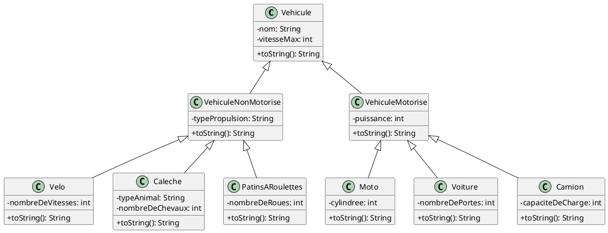
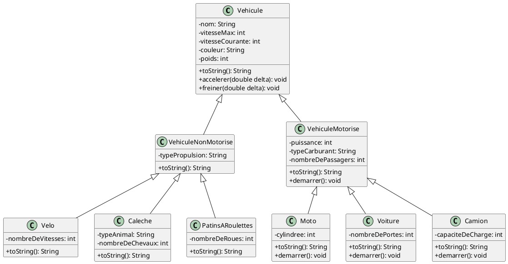

# 5. Exercices sur un système de gestion de véhicules

Voici un exercice sur un système de gestion de véhicules, basé en partie sur l'exemple précédent.

## Partie 1

1. Crée un projet dans IntelliJ nommé `Vehicules`.
2. Crée un *package* nommé `vehicules` dans le dossier `src`.
3. Crée toutes les classes données dans le diagramme de classes suivant.
4. Teste ton code avec le `main` qui suit le diagramme.
    - Pour tester tes classes avec le code du `Main`, tu devras ajouter au moins un constructeur par classe.
5. Ajoutes des *getters* et des *setters* pour tes classes.

### Diagramme de classes



### `Main.java`

```java
import vehicules.*;

public class Main {
    public static void main(String[] args) {
        Velo velo = new Velo("VTT", 40, 21);
        Caleche caleche = new Caleche("vehicules.Caleche de luxe", 10, "Cheval", 2);
        PatinsARoulettes patins = new PatinsARoulettes("Patins de vitesse", 30, 4);
        Moto moto = new Moto("Honda CB500F", 180, 47, 500);
        Voiture voiture = new Voiture("Peugeot 308", 220, 130, 5);
        Camion camion = new Camion("Mercedes-Benz Actros", 120, 500, 20);

        System.out.println("Détails du vélo:\n" + velo);
        System.out.println("\nDétails de la calèche:\n" + caleche);
        System.out.println("\nDétails des patins à roulettes:\n" + patins);
        System.out.println("\nDétails de la moto:\n" + moto);
        System.out.println("\nDétails de la voiture:\n" + voiture);
        System.out.println("\nDétails du camion:\n" + camion);
    }
}
```

## Partie 2

Faites les modifications suivantes au projet.

### Attributs à Ajouter

1. **Couleur** : Ajouter un attribut `couleur` à la classe `Vehicule`.
2. **Poids** : Ajouter un attribut `poids` à la classe `Vehicule`.
3. **Type de Carburant** : Ajouter un attribut `typeCarburant` à la classe `VehiculeMotorise`.
4. **Nombre de Passagers** : Ajouter un attribut `nombreDePassagers` à la classe `VehiculeMotorise`.
5. **Vitesse Courante** : Ajouter un attribut `vitesseCourante` à la classe `Vehicule`.

Ajouter également les *getters* et *setters* correspondants.

### Méthodes à Ajouter

1. **Méthode `demarrer()`** : Ajouter une méthode `demarrer()` à la classe `VehiculeMotorise` pour simuler le démarrage
   du moteur.
2. **Méthode `accelerer(double delta)`** : Ajouter une méthode `accelerer()` à la classe `Vehicule` pour
   simuler l'accélération.
3. **Méthode `freiner(double delta)`** : Ajouter une méthode `freiner()` à la classe `Vehicule` pour simuler le
   freinage.

Le but de cet exercice est de comprendre l'héritage et le polymorphisme. Le but n'est pas de faire une simulation exacte
du comportement des véhicules. Vous pouvez par exemple placer des `println` dans les méthodes, et utiliser le paramètre
`double delta` pour ajouter ou enlever à la vitesse courante, et ne pas calculer l'accélération avec les formules 
physiques correctes. 

### Utilisation du Polymorphisme

- Créer un tableau ou une liste de `Vehicule` et y ajouter des instances de différentes sous-classes.
- Itérer sur ce tableau pour appeler les méthodes ajoutées (`demarrer()`, `accelerer()`, `freiner()`, `calculerPrix()`)
  pour démontrer le polymorphisme.

### Diagramme de classes

