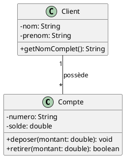

# 1. Notation UML

Le langage UML (Unified Modeling Language) est un standard de modélisation visuelle utilisé pour représenter la
structure et le comportement des systèmes logiciels[2].

## Types principaux de diagrammes UML

Les diagrammes UML se divisent en deux catégories principales :

**Diagrammes structurels**

- Diagrammes de classes (fondement de la programmation orientée objet)
- Diagrammes de composants
- Diagrammes de paquetages

**Diagrammes comportementaux**

- Diagrammes d'activités
- Diagrammes de séquence
- Diagrammes de cas d'utilisation[7]

## Diagrammes de classes

Un diagramme de classes représente la structure statique d'un système orienté objet en montrant les classes, leurs
attributs, leurs méthodes et les relations entre elles[9].

**Notation de base**

Une classe est représentée par un rectangle divisé en trois compartiments :

1. Nom de la classe (obligatoire)
2. Attributs (optionnel)
3. Méthodes (optionnel)[9]

**Visibilité des membres**

- `+` : public
- `-` : private
- `#` : protected
- `~` : package[5]

## Exemple simple en PlantUML



??? important "Source PlantUML"

    ```plantuml
    @startuml
    skinparam classAttributeIconSize 0

    class Compte {
        -numero: String
        -solde: double
        +deposer(montant: double): void
        +retirer(montant: double): boolean
    }

    class Client {
        -nom: String
        -prenom: String
        +getNomComplet(): String
    }

    Client "1" -- "*" Compte : possède
    @enduml
    ```

Dans cet exemple :

- La classe `Compte` a deux attributs privés (`numero` et `solde`) et deux méthodes publiques (`deposer` et `retirer`)
- La classe `Client` a deux attributs privés (`nom` et `prenom`) et une méthode publique (`getNomComplet`)
- L'association entre les classes indique qu'un client peut posséder plusieurs comptes (association "1 à plusieurs")[9]

??? note "Citations"
      - [1] https://plantuml.com/class-diagram
      - [2] https://www.lucidchart.com/pages/fr/langage-uml
      - [3] https://gitmind.com/fr/types-diagrammes-uml.html
      - [4] https://creately.com/blog/fr/uncategorized-fr/tutoriel-sur-les-diagrammes-de-classe/
      - [5] https://www.geeksforgeeks.org/unified-modeling-language-uml-class-diagrams/
      - [6] https://plantuml.com/fr-dark/class-diagram
      - [7] https://miro.com/fr/diagramme/qu-est-ce-qu-un-diagramme-uml/
      - [8] https://ideascale.com/fr/blogues/differents-types-de-diagrammes-duml/
      - [9] https://miro.com/fr/diagramme/qu-est-ce-qu-un-diagramme-de-classe-uml/
      - [10] https://www.lucidchart.com/blog/fr/types-de-diagrammes-UML

-------

??? info "Utilisation de l'IA"
    Page rédigée en partie avec l'aide d'un assistant IA. L'IA a été utilisée pour générer des 
    explications, des exemples et/ou des suggestions de structure. Toutes les informations ont 
    été vérifiées, éditées et complétées par l'auteur.
