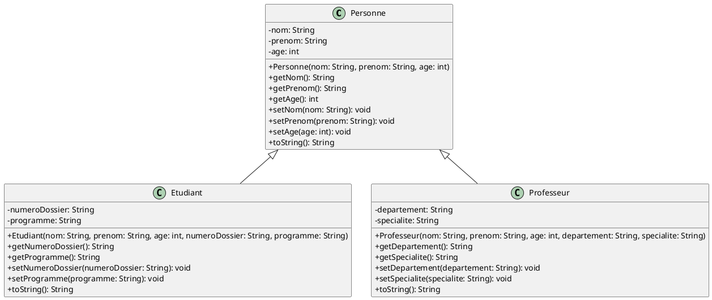
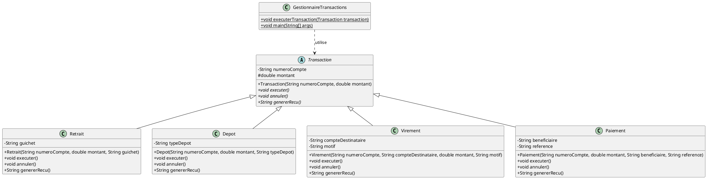

# 🔸2🔸Exemples

## Exemple 1

Voici le diagramme de classes pour 
[l'exemple](http://127.0.0.1:8000/B.%20Programmation%20OO/2.%20H%C3%A9ritage/01-heritage/) `Personne`, `Etudiant` et 
`Professeur` :



??? important "Source PlantUML"

    ```plantuml
    @startuml
    skinparam classAttributeIconSize 0
    
    class Personne {
      -nom: String
      -prenom: String
      -age: int
      +Personne(nom: String, prenom: String, age: int)
      +getNom(): String
      +getPrenom(): String
      +getAge(): int
      +setNom(nom: String): void
      +setPrenom(prenom: String): void
      +setAge(age: int): void
      +toString(): String
    }
    
    class Etudiant {
      -numeroDossier: String
      -programme: String
      +Etudiant(nom: String, prenom: String, age: int, numeroDossier: String, programme: String)
      +getNumeroDossier(): String
      +getProgramme(): String
      +setNumeroDossier(numeroDossier: String): void
      +setProgramme(programme: String): void
      +toString(): String
    }
    
    class Professeur {
      -departement: String
      -specialite: String
      +Professeur(nom: String, prenom: String, age: int, departement: String, specialite: String)
      +getDepartement(): String
      +getSpecialite(): String
      +setDepartement(departement: String): void
      +setSpecialite(specialite: String): void
      +toString(): String
    }
    
    Personne <|-- Etudiant
    Personne <|-- Professeur
    
    @enduml
    ```

Le diagramme montre maintenant la hiérarchie complète où :

- `Personne` est la classe parent (superclasse)
- `Etudiant` et `Professeur` sont des classes enfants (sous-classes)
- Les deux flèches d'héritage `<|--` indiquent que tant `Etudiant` que `Professeur` héritent de `Personne`
- Chaque classe conserve ses propres attributs et méthodes spécifiques
- Les méthodes `toString()` dans `Etudiant` et `Professeur` sont des surcharges de la méthode de la classe `Personne`


## Exemple 2

Voici un autre 
[exemple](http://127.0.0.1:8000/B.%20Programmation%20OO/3.%20Classes%20et%20m%C3%A9thodes%20abstraites/03-exemples/) 
de diagramme de classes pour les transactions bancaires :



??? important "Source PlantUML"

    ```plantuml
    @startuml
    skinparam classAttributeIconSize 0

    abstract class Transaction {
        - String numeroCompte
        # double montant
        + Transaction(String numeroCompte, double montant)
        + {abstract} void executer()
        + {abstract} void annuler()
        + {abstract} String genererRecu()
    }
    
    class Retrait {
        - String guichet
        + Retrait(String numeroCompte, double montant, String guichet)
        + void executer()
        + void annuler()
        + String genererRecu()
    }
    
    class Depot {
        - String typeDepot
        + Depot(String numeroCompte, double montant, String typeDepot)
        + void executer()
        + void annuler()
        + String genererRecu()
    }
    
    class Virement {
        - String compteDestinataire
        - String motif
        + Virement(String numeroCompte, String compteDestinataire, double montant, String motif)
        + void executer()
        + void annuler()
        + String genererRecu()
    }
    
    class Paiement {
        - String beneficiaire
        - String reference
        + Paiement(String numeroCompte, double montant, String beneficiaire, String reference)
        + void executer()
        + void annuler()
        + String genererRecu()
    }
    
    class GestionnaireTransactions {
        + {static} void executerTransaction(Transaction transaction)
        + {static} void main(String[] args)
    }
    
    Transaction <|-- Retrait
    Transaction <|-- Depot
    Transaction <|-- Virement
    Transaction <|-- Paiement
    GestionnaireTransactions ..> Transaction : utilise
    
    @enduml
    ```

Le diagramme montre maintenant :

- La classe abstraite `Transaction` avec ses méthodes abstraites
- Les quatre classes dérivées: `Retrait`, `Depot`, `Virement` et `Paiement`
- Chaque classe dérivée avec ses attributs et méthodes spécifiques
- La classe `GestionnaireTransactions` qui utilise les transactions (relation de dépendance)
- Les relations d'héritage entre `Transaction` et ses classes dérivées
- La relation de dépendance (ligne pointillée) entre `GestionnaireTransactions` et `Transaction`


## Exemple 3

Voici un exemple de diagramme de classes pour
[l'exemple](http://127.0.0.1:8000/B.%20Programmation%20OO/4.%20Interfaces/03-exemples/#exemple-avec-des-animaux) 
des animaux :


??? important "Source PlantUML"

    ```plantuml
    @startuml
    skinparam classAttributeIconSize 0

    abstract class Animal {
      # String nom
      # int age
      + {abstract} void respirer()
      + void dormir()
    }
    
    interface Nageable {
      + void nager()
    }
    
    interface Volant {
      + void voler()
    }
    
    class Dauphin {
      + void respirer()
      + void nager()
    }
    
    class Chauve_Souris {
      + void respirer()
      + void voler()
    }
    
    Animal <|-- Dauphin
    Animal <|-- Chauve_Souris
    Nageable <|.. Dauphin
    Volant <|.. Chauve_Souris
    
    @enduml
    ```

## Légende du diagramme

**Notation utilisée :**

- Les flèches pleines (<|--) indiquent l'héritage de classe
- Les flèches en pointillés (<|..) représentent l'implémentation d'interface
- Le # désigne les membres protégés
- Le + désigne les membres publics
- {abstract} indique une méthode abstraite

Le diagramme illustre la structure complète avec une classe abstraite `Animal`, deux interfaces `Nageable` et `Volant`,
et deux classes concrètes `Dauphin` et `Chauve_Souris` qui étendent `Animal` et implémentent chacune une interface 
spécifique.

-------

!!! note "Note"
    Page rédigée en partie avec l'aide d'un assistant IA, principalement à l'aide de Perplexity AI, avec le *LLM* 
    **Claude 3.5 Sonnet**. L'IA a été utilisée pour générer des explications, des exemples et/ou des suggestions de 
    structure. Toutes les informations ont été vérifiées, éditées et complétées par l'auteur.
