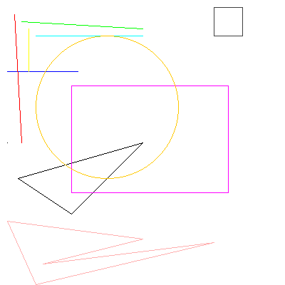

# La classe `Main`

- Github: [Main.java](https://github.com/profdenis/Shapes/tree/master/src/v1/Main.java)

??? note "Code"

    ```java
    package v1;
    
    import java.awt.Color;
    
    public class Main {
    
        public static void main(String[] args) {
            Shapes.drawPoint(10, 200);
            Shapes.drawHorizontalLine(10, 100, 100, Color.BLUE);
            Shapes.drawLine(20, 20, 30, 200, Color.RED);
            Shapes.drawLine(30, 30, 200, 40, Color.GREEN);
            Shapes.drawLine(40, 40, 40, 100, Color.YELLOW);
            Shapes.drawLine(50, 50, 200, 50, Color.CYAN);
            Shapes.drawTriangle(25, 250, 200, 200, 100, 300);
            Shapes.drawRectangle(100, 120, 220, 150, Color.MAGENTA);
            Shapes.drawSquare(300, 10, 40, Color.DARK_GRAY);
            Shapes.drawCircle(150, 150, 100, Color.ORANGE);
            int[] x_values = {10, 200, 60, 300, 50};
            int[] y_values = {310, 335, 370, 340, 399};
    //        Shapes.drawPolyLine(x_values, y_values, Color.PINK );
            Shapes.drawPolygon(x_values, y_values, Color.PINK );
            
            Shapes.image.Save("test1.png");
        }
    }
    ```


Le code dans la classe `Main` utilise la classe `Shapes` pour dessiner différentes formes géométriques. Toutes les
méthodes de la classe `Shapes` sont statiques, ce qui signifie qu'elles appartiennent à la classe elle-même et non à une
instance spécifique de la classe. C'est pourquoi on appelle les méthodes directement avec `Shapes.nomDeLaMethode()` au
lieu de créer un objet `Shapes` avec `Shapes monObjet = new Shapes();` puis appeler la méthode avec
`monObjet.nomDeLaMethode()`.

Utiliser uniquement des méthodes statiques dans une classe comme `Shapes` est contraire aux principes de la
programmation orientée objet. L'un des fondements de la POO est l'utilisation d'objets, qui combinent données (
attributs) et comportement (méthodes). En rendant toutes les méthodes statiques, on ne crée pas d'objets `Shapes` et on
se prive des avantages de l'encapsulation et de la possibilité d'avoir plusieurs instances de `Shapes` avec des états
différents.

Il est important de noter que cette approche est une simplification pour l'exemple et que les versions ultérieures du
code, présentées plus tard dans le cours, utiliseront les principes de la POO de manière plus appropriée.

## Résultat : `test1.png`



-------

!!! note "Note"
    Page rédigée en partie avec l'aide d'un assistant IA, principalement à l'aide de Perplexity AI, avec le *LLM* 
    **Claude 3.5 Sonnet**. L'IA a été utilisée pour générer des explications, des exemples et/ou des suggestions de 
    structure. Toutes les informations ont été vérifiées, éditées et complétées par l'auteur.