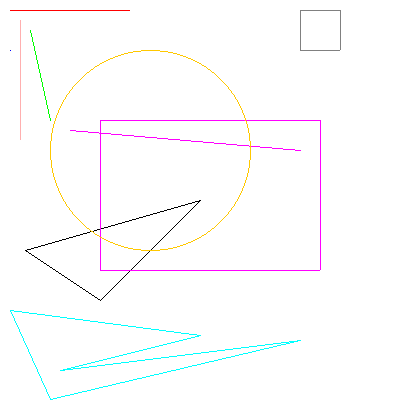

# La classe `Main`

- Github: [Main.java](https://github.com/profdenis/Shapes/tree/master/src/v1/Main.java)

??? note "Code"

      ```java
      package v2;
      
      import v2.shapes.*;
      
      import java.awt.Color;
      
      public class Main {
          public static void main(String[] args) {
              int width = 400;
              Image image = new Image(width);
      
              Point p = new Point(10, 50, Color.BLUE);
              p.draw(image);
      
              HLine hline = new HLine(new Point(10, 10), 120, Color.RED);
              hline.draw(image);
      
              VLine vline = new VLine(new Point(20, 20), 120, Color.PINK);
              vline.draw(image);
      
              Line line1 = new Line(new Point(30, 30), new Point(50, 120), Color.GREEN);
              line1.draw(image);
      
              Line line2 = new Line(new Point(300, 150), new Point(70, 130), Color.MAGENTA);
              line2.draw(image);
      
              Triangle triangle = new Triangle(new Point(25, 250), new Point(200, 200), new Point(100, 300));
              triangle.draw(image);
      
              Rectangle rectangle = new Rectangle(new Point(100, 120), 220, 150, Color.MAGENTA);
              rectangle.draw(image);
      
              Square square = new Square(new Point(300, 10), 40, Color.GRAY);
              square.draw(image);
      
              Circle circle = new Circle(new Point(150, 150), 100, Color.ORANGE);
              circle.draw(image);
      
              Point[] points = {
                      new Point(10, 310),
                      new Point(200, 335),
                      new Point(60, 370),
                      new Point(300, 340),
                      new Point(50, 399)
              };
      //        PolyLine polyLine = new PolyLine(points, Color.PINK);
      //        polyLine.Draw(image);
      
              Polygon polygon = new Polygon(points, Color.CYAN);
              polygon.draw(image);
      
              image.save("test2.png");
          }
      }
      ```

La classe `Main` a pour but de démontrer le dessin de diverses formes sur une image. Décomposons le code étape par
étape :

1. **Initialisation de l'image :** Le code commence par créer un objet `Image` avec une largeur spécifiée (400 pixels
   dans ce cas). Cet objet `Image` servira de canevas pour le dessin.

2. **Création et dessin des formes :** Le code procède ensuite à la création d'instances de différentes classes de
   formes :
    - `Point`: Un simple point avec des coordonnées et une couleur.
    - `HLine`: Une ligne horizontale.
    - `VLine`: Une ligne verticale.
    - `Line`: Une ligne entre deux points.
    - `Triangle`: Un triangle défini par trois points.
    - `Rectangle`: Un rectangle.
    - `Square`: Un carré.
    - `Circle`: Un cercle.
    - `Polygon`: Un polygone défini par un tableau de points.

   Pour chaque forme, le code définit ses propriétés (position, taille, couleur) à l'aide du constructeur ou des
   méthodes setter. Ensuite, il appelle la méthode `draw` sur chaque objet forme, en passant l'objet `Image` comme
   argument. Cette méthode `draw` est responsable du dessin de la forme spécifique sur l'image.

3. **Enregistrement de l'image :** Enfin, après avoir dessiné toutes les formes, le code appelle la méthode `save` sur
   l'objet `Image` pour enregistrer l'image résultante dans un fichier nommé « test2.png ».

L'amélioration clé de `v2` par rapport à une version précédente potentielle (`v1`) est son approche orientée objet.
Chaque forme est représentée par sa propre classe, ce qui rend le code plus organisé, modulaire et extensible. Cette
séparation des préoccupations facilite la maintenance et l'ajout de nouvelles formes à l'avenir.

## Résultat : `test2.png`



-------

!!! note "Note"
      Page rédigée en partie avec l'aide d'un assistant IA, principalement à l'aide de Perplexity AI, avec le *LLM*
      **Claude 3.5 Sonnet**. L'IA a été utilisée pour générer des explications, des exemples et/ou des suggestions de
      structure. Toutes les informations ont été vérifiées, éditées et complétées par l'auteur.