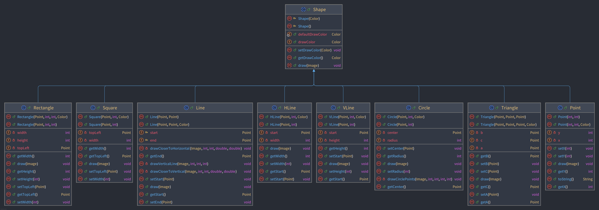

# Introduction

??? note "Code"

    ```java
    package v3.shapes;
    
    import java.awt.Color;
    
    public abstract class Shape
    {
        public static Color defaultDrawColor = Color.BLACK;
        public Color drawColor;
    
        protected Shape(Color drawColor)
        {
            this.drawColor = drawColor;
        }
        
        protected Shape()
        {
            this(defaultDrawColor);
        }
    
        public Color getDrawColor() {
            return drawColor;
        }
    
        public void setDrawColor(Color drawColor) {
            this.drawColor = drawColor;
        }
    
        public abstract void draw(Image image);
    }
    ```


Dans cette version, la classe `Shape` est une classe de base abstraite pour toutes les formes. Elle centralise les
propriétés et les comportements communs à toutes les formes. Dans cet exemple, la propriété commune est la couleur de
dessin (`drawColor`).

Elle est déclarée abstraite pour deux raisons principales :

1. **Impossibilité d'instancier directement :** Une forme "générique" n'a pas de sens en soi. On ne peut pas dessiner
   une "forme" sans plus de précisions. L'abstraction empêche la création d'objets `Shape` directement. On doit créer
   des instances de classes concrètes comme `Point` ou `Circle`.

2. **Définition d'un contrat :** La méthode `draw` est déclarée abstraite dans `Shape`. Cela oblige toutes les classes
   dérivées (comme `Point` et `Circle`) à fournir leur propre implémentation de la méthode `draw`. Chaque forme doit
   savoir se dessiner elle-même. C'est ce qu'on appelle un "contrat" : toute classe qui hérite de `Shape` s'engage à
   implémenter `draw`.

En résumé, `Shape` fournit un modèle commun pour les formes, gère les propriétés partagées, et impose aux formes
concrètes de définir comment elles se dessinent.


## Diagrammes de classes

### Version IntelliJ



### Version PlantUML

```puml
@startuml

skinparam linetype ortho
skinparam classAttributeIconSize 0

class Circle {
  + Circle(Point, int, Color): 
  + Circle(Point, int): 
  - center: Point
  - radius: int
  + setCenter(Point): void
  + getRadius(): int
  + draw(Image): void
  + setRadius(int): void
  - drawCirclePoints(Image, int, int, int, int): void
  + getCenter(): Point
}
class HLine {
  + HLine(Point, int, Color): 
  + HLine(Point, int): 
  - start: Point
  - width: int
  + draw(Image): void
  + getWidth(): int
  + setWidth(int): void
  + getStart(): Point
  + setStart(Point): void
}
class Line {
  + Line(Point, Point): 
  + Line(Point, Point, Color): 
  # start: Point
  # end: Point
  - drawCloserToHorizontal(Image, int, int, double, double): void
  + getEnd(): Point
  - drawVerticalLine(Image, int, int, int): void
  - drawCloserToVertical(Image, int, int, double, double): void
  + setStart(Point): void
  + draw(Image): void
  + getStart(): Point
  + setEnd(Point): void
}
class Point {
  + Point(int, int): 
  + Point(int, int, Color): 
  - y: int
  - x: int
  + setX(int): void
  + setY(int): void
  + draw(Image): void
  + getY(): int
  + toString(): String
  + getX(): int
}
class Rectangle {
  + Rectangle(Point, int, int, Color): 
  + Rectangle(Point, int, int): 
  - width: int
  - height: int
  - topLeft: Point
  + getWidth(): int
  + draw(Image): void
  + getHeight(): int
  + setHeight(int): void
  + setTopLeft(Point): void
  + getTopLeft(): Point
  + setWidth(int): void
}
class Shape {
  # Shape(Color): 
  # Shape(): 
  + defaultDrawColor: Color
  + drawColor: Color
  + setDrawColor(Color): void
  + getDrawColor(): Color
  + draw(Image): void
}
class Square {
  + Square(Point, int, Color): 
  + Square(Point, int): 
  - topLeft: Point
  - width: int
  + getWidth(): int
  + getTopLeft(): Point
  + draw(Image): void
  + setTopLeft(Point): void
  + setWidth(int): void
}
class Triangle {
  + Triangle(Point, Point, Point): 
  + Triangle(Point, Point, Point, Color): 
  - b: Point
  - c: Point
  - a: Point
  + getB(): Point
  + setB(Point): void
  + setC(Point): void
  + draw(Image): void
  + getC(): Point
  + setA(Point): void
  + getA(): Point
}
class VLine {
  + VLine(Point, int, Color): 
  + VLine(Point, int): 
  - start: Point
  - height: int
  + getHeight(): int
  + setStart(Point): void
  + draw(Image): void
  + setHeight(int): void
  + getStart(): Point
}

Circle     --^  Shape     
HLine      -[#000082,plain]-^  Shape     
Line       -[#000082,plain]-^  Shape     
Point      -[#000082,plain]-^  Shape     
Rectangle  -[#000082,plain]-^  Shape     
Square     -[#000082,plain]-^  Shape     
Triangle   -[#000082,plain]-^  Shape     
VLine      -[#000082,plain]-^  Shape
     
@enduml
```




??? important "Source PlantUML"

        ```plantuml
        @startuml
        
        skinparam linetype ortho
        skinparam classAttributeIconSize 0
        
        class Circle {
          + Circle(Point, int, Color): 
          + Circle(Point, int): 
          - center: Point
          - radius: int
          + setCenter(Point): void
          + getRadius(): int
          + draw(Image): void
          + setRadius(int): void
          - drawCirclePoints(Image, int, int, int, int): void
          + getCenter(): Point
        }
        class HLine {
          + HLine(Point, int, Color): 
          + HLine(Point, int): 
          - start: Point
          - width: int
          + draw(Image): void
          + getWidth(): int
          + setWidth(int): void
          + getStart(): Point
          + setStart(Point): void
        }
        class Line {
          + Line(Point, Point): 
          + Line(Point, Point, Color): 
          # start: Point
          # end: Point
          - drawCloserToHorizontal(Image, int, int, double, double): void
          + getEnd(): Point
          - drawVerticalLine(Image, int, int, int): void
          - drawCloserToVertical(Image, int, int, double, double): void
          + setStart(Point): void
          + draw(Image): void
          + getStart(): Point
          + setEnd(Point): void
        }
        class Point {
          + Point(int, int): 
          + Point(int, int, Color): 
          - y: int
          - x: int
          + setX(int): void
          + setY(int): void
          + draw(Image): void
          + getY(): int
          + toString(): String
          + getX(): int
        }
        class Rectangle {
          + Rectangle(Point, int, int, Color): 
          + Rectangle(Point, int, int): 
          - width: int
          - height: int
          - topLeft: Point
          + getWidth(): int
          + draw(Image): void
          + getHeight(): int
          + setHeight(int): void
          + setTopLeft(Point): void
          + getTopLeft(): Point
          + setWidth(int): void
        }
        class Shape {
          # Shape(Color): 
          # Shape(): 
          + defaultDrawColor: Color
          + drawColor: Color
          + setDrawColor(Color): void
          + getDrawColor(): Color
          + draw(Image): void
        }
        class Square {
          + Square(Point, int, Color): 
          + Square(Point, int): 
          - topLeft: Point
          - width: int
          + getWidth(): int
          + getTopLeft(): Point
          + draw(Image): void
          + setTopLeft(Point): void
          + setWidth(int): void
        }
        class Triangle {
          + Triangle(Point, Point, Point): 
          + Triangle(Point, Point, Point, Color): 
          - b: Point
          - c: Point
          - a: Point
          + getB(): Point
          + setB(Point): void
          + setC(Point): void
          + draw(Image): void
          + getC(): Point
          + setA(Point): void
          + getA(): Point
        }
        class VLine {
          + VLine(Point, int, Color): 
          + VLine(Point, int): 
          - start: Point
          - height: int
          + getHeight(): int
          + setStart(Point): void
          + draw(Image): void
          + setHeight(int): void
          + getStart(): Point
        }
        
        Circle     --^  Shape     
        HLine      -[#000082,plain]-^  Shape     
        Line       -[#000082,plain]-^  Shape     
        Point      -[#000082,plain]-^  Shape     
        Rectangle  -[#000082,plain]-^  Shape     
        Square     -[#000082,plain]-^  Shape     
        Triangle   -[#000082,plain]-^  Shape     
        VLine      -[#000082,plain]-^  Shape
             
        @enduml
        ```


-------

??? info "Utilisation de l'IA"
    Page rédigée en partie avec l'aide d'un assistant IA. L'IA a été utilisée pour générer des 
    explications, des exemples et/ou des suggestions de structure. Toutes les informations ont 
    été vérifiées, éditées et complétées par l'auteur.