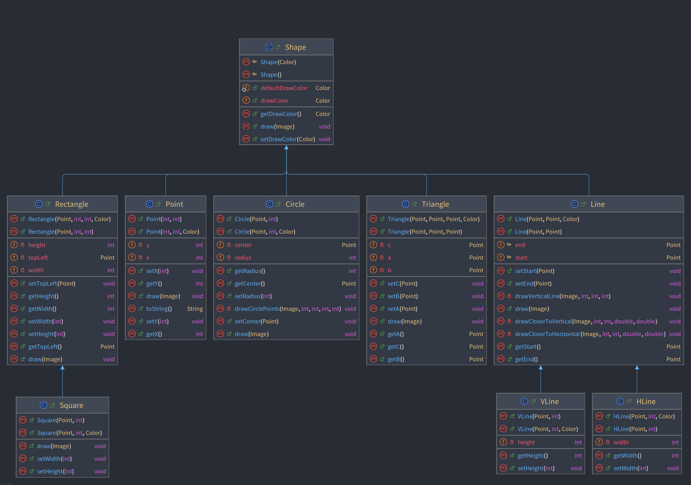
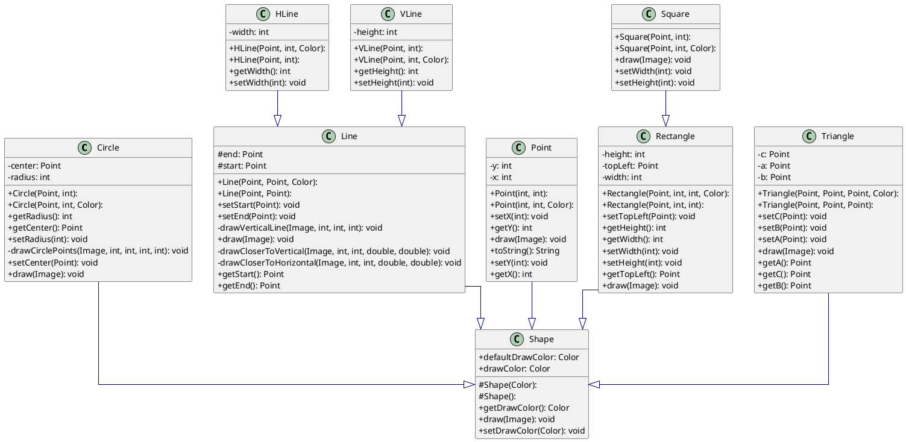

# Introduction

Il y a 3 différences entre les versions 3 et 4, regroupées autour de `Rectangle` et de `Line` :

1. `Square` est maintenant une sous-classe de `Rectangle`, parce qu'un carré est un rectangle, mais avec la condition
   supplémentaire que la longueur et la largeur sont identiques. Tout carré est un rectangle, mais en général, un
   rectangle n'est pas un carré. Il faut redéfinir `setWidth` et `setHeight` dans `Square` pour s'assurer que la largeur
   et la hauteur d'un carré sont toujours identiques.
2. `HLine` et `Vline` sont des sous-classes de `Line`, parce qu'une ligne horizontale est une ligne et une ligne
   verticale est évidemment aussi une ligne. `Line` représente une ligne quelconque, et `HLine` et `Vline` sont plus
   spécifiques.

## Diagrammes de classes

### Version IntelliJ



### Version PlantUML



??? important "Source PlantUML"

        ```plantuml
        @startuml
        
        skinparam linetype ortho
        skinparam classAttributeIconSize 0
        
        class Circle {
          + Circle(Point, int): 
            + Circle(Point, int, Color): 
            - center: Point
            - radius: int
            + getRadius(): int
            + getCenter(): Point
            + setRadius(int): void
            - drawCirclePoints(Image, int, int, int, int): void
            + setCenter(Point): void
            + draw(Image): void
        }
        class HLine {
            + HLine(Point, int, Color): 
            + HLine(Point, int): 
            - width: int
            + getWidth(): int
            + setWidth(int): void
        }
        class Line {
            + Line(Point, Point, Color): 
            + Line(Point, Point): 
          # end: Point
          # start: Point
          + setStart(Point): void
            + setEnd(Point): void
            - drawVerticalLine(Image, int, int, int): void
            + draw(Image): void
            - drawCloserToVertical(Image, int, int, double, double): void
            - drawCloserToHorizontal(Image, int, int, double, double): void
            + getStart(): Point
            + getEnd(): Point
        }
        class Point {
            + Point(int, int): 
            + Point(int, int, Color): 
            - y: int
            - x: int
            + setX(int): void
            + getY(): int
            + draw(Image): void
            + toString(): String
            + setY(int): void
            + getX(): int
        }
        class Rectangle {
            + Rectangle(Point, int, int, Color): 
            + Rectangle(Point, int, int): 
            - height: int
            - topLeft: Point
            - width: int
            + setTopLeft(Point): void
            + getHeight(): int
            + getWidth(): int
            + setWidth(int): void
            + setHeight(int): void
            + getTopLeft(): Point
            + draw(Image): void
        }
        class Shape {
          # Shape(Color): 
          # Shape(): 
          + defaultDrawColor: Color
            + drawColor: Color
            + getDrawColor(): Color
            + draw(Image): void
            + setDrawColor(Color): void
        }
        class Square {
            + Square(Point, int): 
            + Square(Point, int, Color): 
            + draw(Image): void
            + setWidth(int): void
            + setHeight(int): void
        }
        class Triangle {
            + Triangle(Point, Point, Point, Color): 
            + Triangle(Point, Point, Point): 
            - c: Point
            - a: Point
            - b: Point
            + setC(Point): void
            + setB(Point): void
            + setA(Point): void
            + draw(Image): void
            + getA(): Point
            + getC(): Point
            + getB(): Point
        }
        class VLine {
            + VLine(Point, int): 
            + VLine(Point, int, Color): 
            - height: int
            + getHeight(): int
            + setHeight(int): void
        }
        
        Circle     -[#000082,plain]-^  Shape     
        HLine      -[#000082,plain]-^  Line      
        Line       -[#000082,plain]-^  Shape     
        Point      -[#000082,plain]-^  Shape     
        Rectangle  -[#000082,plain]-^  Shape     
        Square     -[#000082,plain]-^  Rectangle 
        Triangle   -[#000082,plain]-^  Shape     
        VLine      -[#000082,plain]-^  Line      
        @enduml

        ```
