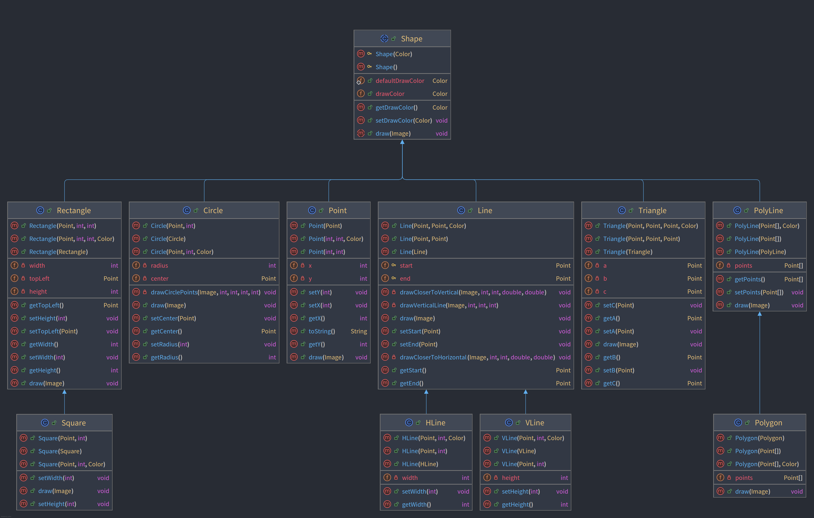
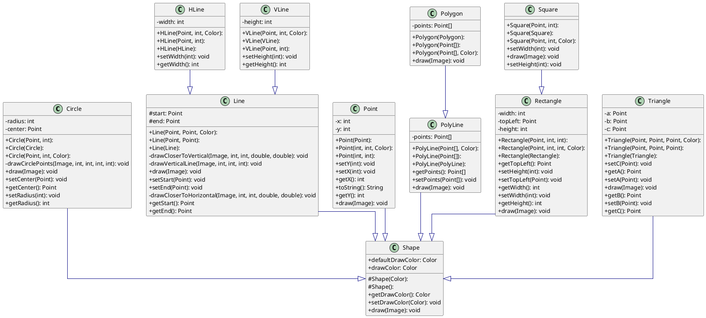

# Introduction

Les classes `PolyLine` et `Polygon` avaient été laissées de côté dans les versions 3 et 4. On peut remarquer qu'un
polygone peut être dessiné, dans un premier temps, de la même façon qu'une ligne brisée (*polyline*), et ensuite une
ligne supplémentaire est dessinée pour *boucler la boucle*. Donc la méthode `draw` de `Polygon` commence par appeler
`super.draw(image);` pour dessiner une *polyline*, et ensuite une ligne est dessinée entre le premier et dernier point.
`Polygon` est bien un cas particulier de `PolyLine` avec une caractéristique de plus (la ligne entre les premier et
dernier points).

On ne pourrait pas avoir l'inverse, avec `PolyLine` comme sous-classe de `Polygone`, parce que la super-classe dans ce
cas dessinerait une ligne de trop, que la sous-classe `PolyLine` ne pourrait pas facilement effacer.

## Diagrammes de classes

### Version IntelliJ



### Version PlantUML



??? important "Source PlantUML"

        ```plantuml
        @startuml
        
        skinparam linetype ortho
        skinparam classAttributeIconSize 0
        
        class Circle {
          + Circle(Point, int): 
            + Circle(Circle): 
            + Circle(Point, int, Color): 
            - radius: int
            - center: Point
            - drawCirclePoints(Image, int, int, int, int): void
            + draw(Image): void
            + setCenter(Point): void
            + getCenter(): Point
            + setRadius(int): void
            + getRadius(): int
        }
        class HLine {
            + HLine(Point, int, Color): 
            + HLine(Point, int): 
            + HLine(HLine): 
            - width: int
            + setWidth(int): void
            + getWidth(): int
        }
        class Line {
            + Line(Point, Point, Color): 
            + Line(Point, Point): 
            + Line(Line): 
          # start: Point
          # end: Point
          - drawCloserToVertical(Image, int, int, double, double): void
            - drawVerticalLine(Image, int, int, int): void
            + draw(Image): void
            + setStart(Point): void
            + setEnd(Point): void
            - drawCloserToHorizontal(Image, int, int, double, double): void
            + getStart(): Point
            + getEnd(): Point
        }
        class Point {
            + Point(Point): 
            + Point(int, int, Color): 
            + Point(int, int): 
            - x: int
            - y: int
            + setY(int): void
            + setX(int): void
            + getX(): int
            + toString(): String
            + getY(): int
            + draw(Image): void
        }
        class PolyLine {
            + PolyLine(Point[], Color): 
            + PolyLine(Point[]): 
            + PolyLine(PolyLine): 
            - points: Point[]
            + getPoints(): Point[]
            + setPoints(Point[]): void
            + draw(Image): void
        }
        class Polygon {
            + Polygon(Polygon): 
            + Polygon(Point[]): 
            + Polygon(Point[], Color): 
            - points: Point[]
            + draw(Image): void
        }
        class Rectangle {
            + Rectangle(Point, int, int): 
            + Rectangle(Point, int, int, Color): 
            + Rectangle(Rectangle): 
            - width: int
            - topLeft: Point
            - height: int
            + getTopLeft(): Point
            + setHeight(int): void
            + setTopLeft(Point): void
            + getWidth(): int
            + setWidth(int): void
            + getHeight(): int
            + draw(Image): void
        }
        class Shape {
          # Shape(Color): 
          # Shape(): 
          + defaultDrawColor: Color
            + drawColor: Color
            + getDrawColor(): Color
            + setDrawColor(Color): void
            + draw(Image): void
        }
        class Square {
            + Square(Point, int): 
            + Square(Square): 
            + Square(Point, int, Color): 
            + setWidth(int): void
            + draw(Image): void
            + setHeight(int): void
        }
        class Triangle {
            + Triangle(Point, Point, Point, Color): 
            + Triangle(Point, Point, Point): 
            + Triangle(Triangle): 
            - a: Point
            - b: Point
            - c: Point
            + setC(Point): void
            + getA(): Point
            + setA(Point): void
            + draw(Image): void
            + getB(): Point
            + setB(Point): void
            + getC(): Point
        }
        class VLine {
            + VLine(Point, int, Color): 
            + VLine(VLine): 
            + VLine(Point, int): 
            - height: int
            + setHeight(int): void
            + getHeight(): int
        }
        
        Circle     -[#000082,plain]-^  Shape     
        HLine      -[#000082,plain]-^  Line      
        Line       -[#000082,plain]-^  Shape     
        Point      -[#000082,plain]-^  Shape     
        PolyLine   -[#000082,plain]-^  Shape     
        Polygon    -[#000082,plain]-^  PolyLine  
        Rectangle  -[#000082,plain]-^  Shape     
        Square     -[#000082,plain]-^  Rectangle 
        Triangle   -[#000082,plain]-^  Shape     
        VLine      -[#000082,plain]-^  Line      
        @enduml
        ```

-------

??? info "Utilisation de l'IA"
    Page rédigée en partie avec l'aide d'un assistant IA. L'IA a été utilisée pour générer des 
    explications, des exemples et/ou des suggestions de structure. Toutes les informations ont 
    été vérifiées, éditées et complétées par l'auteur.